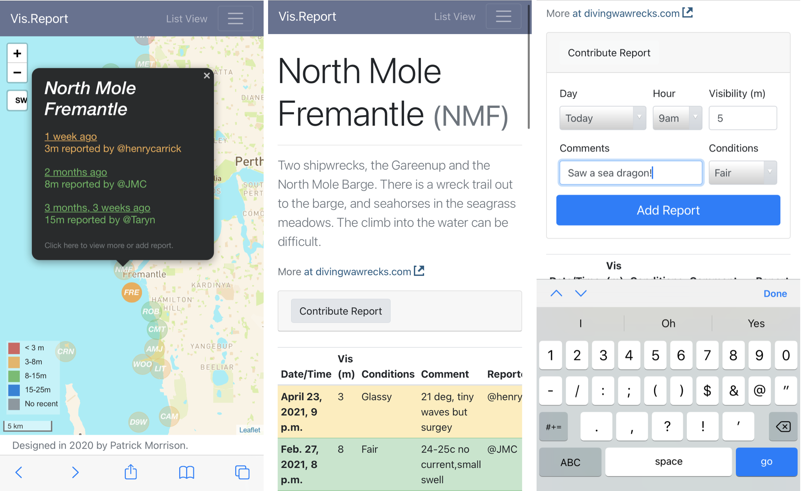

# What is visibility?

Visibility varies far more underwater than it does land. On a perfect day in Perth, Western Australia, a diver might be able to see 25m. On a bad day in the Swan River, that may be closer to 25cm.

This is one of the most important factors in dive planning. For training or research diving, poor visibility can be the difference between success and failure. We do a lot of 3D recording of shipwrecks using photogrammetry - and some wrecks have proven impossible to record on all but the clearest days.

Divers often share 'visibility reports', now mostly though big Facebook groups. Sometimes they are shared proactively, and other times in response to people asking things like: 'does anyone have a visibility report for the Omeo shipwreck this morning?'. 

 at 10am on July 18th, 2021. Tannin-stained freshwater runs over the clearer salt water below, blocking out the light.")

# Standardised reporting with Vis.Report

[Vis.Report](https://vis.report) is a website where divers can submit visibility reports through forms, accessible through a map interface. Each site has a page, which shows a table of reports and allows users to enter a new one (see this one for [North Mole](https://vis.report/NMF)).



The input was intentionally limited to encourage timely and standardised reporting. The variables reported are:

-   Date/time (today/yesterday, and hour)

-   Visibility (m)

-   Conditions (Glassy/Fair/Windy/Rough)

-   Comments (30 characters)

The visibility is visualised by colour, both on the map and table views. Groups were chosen to best assist diver planning, and changed with consultation. Most agreed that anything below 3m is challenge, and anything above 8m makes for an above-average dive. The final ranges were: [\<3m]{style="color:#d9534f;font-weight:bold;"}, [3-8m]{style="color: #f0ad4e;font-weight:bold"}, [8-15m]{style="color: #5cb85c;font-weight:bold"}, and [15-25m]{style="color: #0275d8;font-weight:bold"}.

The site is built using [Django](https://www.djangoproject.com), a Python web framework. This connects to a [PostGIS](https://postgis.net)/PostgreSQL database, storing site locations and reports. The main map interface was built using the [Leaflet](https://leafletjs.com) mapping library for Javascript. This combination proved perfect for a site like this, and all the the code is available on my Github: <https://github.com/patrick-morrison/visreport>.

# Learning from the data

Site information and reports are both made available as json files, and can be downloaded directly for analysis. The data and code used for this blog post is also available on Github: <https://github.com/patrick-morrison/predicting_visibility_blogpost>.

```{r download, fig.height=6}
library(tidyverse)
library(jsonlite)
library(lubridate)
theme_set(theme_minimal())

#load sites data
#download.file("https://vis.report/sites.json/", destfile = 'data/sites.json')
sites_json <- fromJSON("data/sites.json")
sites <- sites_json$features$properties

#load reports
#download.file("https://vis.report/reports.json/", destfile = 'data/reports.json')
reports_json <- fromJSON("data/reports.json")
reports <- reports_json$features$properties %>%
  mutate(when_observed = ymd_hms(when_observed, tz = "Australia/Perth")) %>%
  left_join(
    select(sites, pk, site_region_primary, site_region_secondary),
    by = c("site" = "pk")) %>% 
  filter(site_region_primary == "Perth")

reports %>%
  ggplot(aes(when_observed, visibility)) +
  facet_grid(rows = vars(site_region_secondary)) +
  labs(title = "Visibility for Perth dive sites",
       caption = paste(nrow(filter(reports, site_region_primary == "Perth")),
                       "reports contributed by users of Vis.Report"),
       x = "", y = "Reported visibility (m)") +
  geom_line(size = 0.5, col = "deepskyblue4") +
  geom_point(size = 1, col = "dodgerblue4") +
  scale_x_datetime(date_breaks = "2 month",
               date_minor_breaks = "1 week", date_labels = "%b %y")
```

As of `r today()` there are reports from `r length(unique(reports[reports$site_region_primary=='Perth',"site"]))` sites in the Perth metro area. Across `r length(reports[reports$site_region_primary=='Perth',"visibility"])` reports, the mean visibility was `r round(mean(reports[reports$site_region_primary=='Perth',"visibility"]),1)`m (SD=`r round(sd(reports[reports$site_region_primary=='Perth',"visibility"]),1)`m).

### Site averages

The biggest predictor of visibility is the site itself. There is clear spatial patterning which supports known patterns:

-   Vis is generally better in the ocean than the river

-   Vis is better further from shore

-   North of the river has better vis than the south

The map below shows Perth metro sites, and indicates their mean visibility with the same colour scheme used on Vis.Report. The bigger the circle, the more reports. Hover the circles for summary data on each site.

```{r map, fig.height=5}
library(leaflet)
library(sf)
library(geojsonsf)

mean_vis <- reports %>% group_by(site) %>% 
  summarise(mean_vis = mean(visibility),
            sd_vis = sd(visibility),
            n_vis = n()) %>%
  mutate(colour = cut(
  mean_vis,
  breaks = c(0, 3, 8, 15, Inf),
  labels = c("#d9534f", "#f0ad4e", "#5cb85c", "#0275d8"),
  right  = FALSE
))

reports_sf <- geojson_sf("data/sites.json") %>%
  left_join(mean_vis, by = c("pk" = "site")) %>% 
  filter(site_region_primary == "Perth")

labels <- sprintf(
  "<strong>%s (%s)</strong><br/>Mean vis: %sm (sd=%sm)<br/>%s reports",
  reports_sf$site_name, reports_sf$pk,
  round(reports_sf$mean_vis, 1),
  round(reports_sf$sd_vis, 1),
  reports_sf$n_vis) %>% lapply(htmltools::HTML)

  leaflet(reports_sf) %>%
  addProviderTiles(providers$CartoDB.Positron,
                   options = providerTileOptions(
                     minZoom = 9, maxZoom = 12)) %>%
  addCircleMarkers(
  radius = ~log(n_vis + 2) * 3,
  label = labels,
  labelOptions = labelOptions(textsize = "13px"),
  color = ~(colour)) %>%
    addLegend("bottomleft", title = "Mean vis",
              labels = c("< 3m", "3-8m", "8-15m", "15-25m"),
              colors = c("#d9534f", "#f0ad4e", "#5cb85c", "#0275d8"),
    opacity = .9)
```

### Swell, wind and rain

The swell, wind and rain over the last week is thought to impact visibility. The last 5 days of weather (including that day) are rolling averaged, to capture longer term effects. Wind and rain was pulled from the [Bureau of Meteorology's Perth daily weather observations](http://www.bom.gov.au/climate/dwo/202108/html/IDCJDW6111.202108.shtml). Swell was pulled using the [Stormglass weather API](https://stormglass.io), which suggests Météo-France as the best data source for this region. NOAA data was also tested and performs similarly.

```{r weather, fig.height=5, message=FALSE, warning=FALSE}
library(zoo)

# #Stormglass for swell
# #API call commented, because processed file is available in Github repo
# 
# library(httr)
# 
# api_key = "API_KEY HERE"
# weeks_active <- seq(ymd('2020-02-01'),ymd('2021-08-21'),by = 'weeks')
# week <- 1
# 
# for (week in 1:82) {
# forecast <- GET("https://api.stormglass.io/v2/weather/point",
#          query = list('lat'= '-32.06453749470132',
#                       'lng' = '115.68122863769531',
#                       'start' = weeks_active[week],
#                       'source' = 'sg',
#                       'params' = paste('waveHeight', 'waveDirection',
#                                        'gust','windDirection',
#                                        'windSpeed','windWaveHeight',
#                                        'swellDirection', 'swellHeight',
#                                        'swellPeriod','airTemperature', 
#                                        'currentDirection', 'currentSpeed',   sep=',')),
#          add_headers('Authorization' = api_key))
# 
# r <- content(forecast, "parsed")
# weather <- tibble(hour = 1:241, time = 1:241,
#                   windspeed = 1:241, winddir = 1:241,
#                   swellheight = 1:241, swellPeriod = 1:241, swellDirection=1:241,
#                   airTemperature=1:241)
# 
# for (hour in 1:241){
#   weather$time[hour] <- r$hours[[hour]]$time
#   weather$airTemperature[hour] <- r$hours[[hour]]$airTemperature$sg
#   weather$windspeed[hour] <- r$hours[[hour]]$windSpeed$sg
#   weather$winddir[hour] <- r$hours[[hour]]$windDirection$sg
#   weather$swellheight[hour] <- r$hours[[hour]]$swellHeight$sg
#   weather$swellPeriod[hour] <- r$hours[[hour]]$swellPeriod$sg
#   weather$swellDirection[hour] <- r$hours[[hour]]$swellDirection$sg
# }
# write_csv(weather, paste0('data/stormglass/', week, "_forecast.csv"))
# }
# 
# stormglass <-
#     list.files(path = "data/stormglass/", pattern = "*.csv",full.names = TRUE) %>%
#     map_df(~read_csv(.,
#                      col_types = cols(
#   time = col_datetime(format = ""),
#   windspeed = col_double(),
#   winddir = col_double(),
#   swellheight = col_double(),
#   swellDirection = col_double(),
#   airTemperature = col_double())
#   )) %>% arrange(time)
# stormglass$hour <- NULL
# stormglass <- distinct(stormglass)
# write_csv(stormglass, 'data/stormglass_historical_fremantle_meteo.csv')

stormglass <- read_csv("data/stormglass_historical_fremantle_meteo.csv") %>% 
  arrange(time) %>% 
  mutate(swell_5 = round(
    rollapply(swellheight, 5 * 24, mean,
              align = "right", fill = NA),1))
lubridate::tz(stormglass$time) <- "UTC"

#Read folder of CSVs from BOM daily weather observation.

# bom <- list.files(path = "data/bom/", pattern = "*.csv", full.names = TRUE) %>% 
#     map(read_csv, 
#     col_types = cols(Date = col_date(format = "%Y-%m-%d"), 
#         `Time of maximum wind gust` = col_time(format = "%H:%M"), 
#         X1 = col_skip()), skip = 7) %>%
#     reduce(rbind) 
# 
# bom_meta <- read_csv("data/bom/BOM-meta.txt")
# colnames(bom) <- bom_meta$Short
# 
# write_csv(bom, "data/bom_perth.csv")

bom <- read_csv("data/bom_perth.csv") %>% 
    arrange(date) %>% 
    mutate(wind_speed3 = as.numeric(replace(wind_speed3, wind_speed3 == "Calm",0)),
           wind_speed9 = as.numeric(replace(wind_speed9, wind_speed9 == "Calm", 0)),
           wind_speed_avg = (wind_speed9+wind_speed3)/2,
           rain_5 = rollapply(rain, 5, mean,
                          na.rm = T, partial = T, align = "right", fill = NA),
           wind_5 = rollapply(wind_speed_avg, 5, mean,
                          na.rm = T, partial = T, align = "right", fill = NA)
         )

reports_weather <- reports %>%
  left_join(stormglass, by = c("when_observed" = "time")) %>%
  mutate(colour = cut(
  visibility,
  breaks = c(0, 3, 8, 15, Inf),
  labels = c("Red", "Orange", "Green", "Blue"),
  right  = FALSE
)) %>%
  mutate(date = date(when_observed)) %>%
  left_join(bom)

r <- reports_weather %>%
  select('date' = when_observed, site, visibility, swell_5, rain_5, wind_5) %>% 
  drop_na()

rmarkdown::paged_table(r)
```

### Traditional regression models don't work

How might we go about modelling visibility? I have defined an acceptable prediction as within 3m, a range within which you can can comfortably plan a dive. We also want to be able to capture good days and bad days.

A simple approach would be to use a simple linear regression on the weather. This performs terribly, dragging every site down towards the population mean, and not discerning between Rottnest and the river. It does capture a negative effect of swell, but this is drowned out by the missing site information. In comparison, just using mean visibility for that site performs better, even though it cannot discern between a perfect day and tropical storm. This wouldn't be an inspiring use of statistics. We need a sensible way of combing these two pieces of information. 

```{r simple, message=FALSE, warning=FALSE}
lm_fit <- lm(visibility ~ swell_5 + rain_5 + wind_5, data = r)
lm_prediction <- predict(lm_fit, r)

site_means <- r %>% group_by(site) %>% summarise(mean=mean(visibility))

first_predictions <- tibble(
  "site" = r$site, "vis" = r$visibility,
  "lm" = lm_prediction, "mean" = left_join(r, site_means)$mean) %>% 
  pivot_longer(cols = c(lm,mean), names_to = "method", values_to = "pred") %>% 
  mutate(
    vis_c = cut(vis,
                breaks = c(0, 3, 8, 15, Inf),
                labels = c("Red", "Orange", "Green", "Blue"),
                right  = FALSE),
    vis_p = cut(pred,
                breaks = c(0, 3, 8, 15, Inf),
                labels = c("Red", "Orange", "Green", "Blue"),
                right  = FALSE),
  ) %>%
  mutate(
    acceptable = (abs(vis - pred) <= 3)
  )

accuracy <- first_predictions %>%
  group_by(method) %>% 
  summarise(perc = round(mean(acceptable)*100))

first_accuracy_statement <- sprintf(
  "Linear model is %01d%% accurate, and mean-only model is %01d%% accurate.", 
  pull(filter(accuracy,method=='lm'),perc),
  pull(filter(accuracy,method=='mean'),perc)
  )

ggplot(first_predictions, aes(vis, pred, colour = acceptable)) +
  geom_jitter(alpha = 0.5) +
  geom_text(aes(label = site), size = 3,
            position = "jitter", hjust = "inward", check_overlap = TRUE, ) +
  geom_abline(slope = 1, intercept = 0) +
  coord_equal() + expand_limits(x = 25, y=25) + 
  facet_grid(cols = vars(method)) +
  theme(legend.position = "bottom") +
  labs(x = "True visibility", y = "Predicted visibility",
       colour = "±3m",
       title = "Traditional regression is a terrible predictor",
       subtitle = first_accuracy_statement) +
  scale_color_manual(values = c("TRUE" = "#1B54A8", "FALSE" = "#701C00"))
```


### Building a hierarchical model

A [hierarchical Bayesian model](https://cran.r-project.org/web/packages/brms/vignettes/brms_multilevel.pdf) can estimate population effects, while allowing the intercept and slope to vary by site _(s)_. This means the model can account for sites having different average visibilities and varying in their sensitivity to different weather conditions. See [Richard McElreath's Statistical Rethinking 2nd Edition](https://xcelab.net/rm/statistical-rethinking/) (p. 442, 14.1.3. The varying slopes model) for a similar model, or [Solomon Kurz's brms translation](https://bookdown.org/content/4857/adventures-in-covariance.html#the-varying-slopes-model.).

```{r model, echo=T, results='hide'}
library(brms)

formula <-
  visibility ~ swell_5 + rain_5 + wind_5 +
  (1 + swell_5 + rain_5 + wind_5 | site)

priors <- c(
  #Intercepts and coefficients
  prior(normal(0,1), class = Intercept),
  prior(normal(0,1), class = b),
  #Standard deviations
  prior(exponential(1), class = sd),
  prior(exponential(1), class = sigma),
  #Correlation matrix
  prior(lkj(2), class = cor)
  )
  
model <- brm(formula, family = lognormal(),
             data = r, prior = priors,
             iter = 4000, chains = 4, cores = 4)
```

<center>Log-normal likelihood and linear model:</center>
$$
\text{visibility}_i \sim \text{Log-Normal}(\mu_i, \sigma) \\
\mu_{i} = a_{[s]} + \beta_{1[s]} \text{wind}_i + \beta_{2[s]} \text{rain}_i + \beta_{3[s]} \text{swell}_i \\
$$
<center>Varying slopes and intercepts:</center>
$$
\left(
  \begin{array}{c} 
    \begin{aligned}
      &\alpha_{[s]} \\
      &\beta_{1[s]} \\
      &\beta_{2[s]} \\
      &\beta_{3[s]}
    \end{aligned}
  \end{array}
\right) 
\sim\text{MVNormal}
\left[
\left(
  \begin{array}{c} 
    \begin{aligned}
      &\alpha\\
      &\beta_1 \\
      &\beta_2 \\
      &\beta_3
    \end{aligned}
  \end{array}
\right)
,
\textbf{S}
\right] \\ 
\textbf{S}=
\left(
  \begin{array}{cccc}
     \sigma_{\alpha} & 0 & 0 & 0 \\ 
     0 & \sigma_{\beta_1} & 0 & 0 \\ 
     0 & 0 & \sigma_{\beta_2} & 0 \\ 
     0 & 0 & 0 & \sigma_{\beta_3}
  \end{array}
\right)
\textbf{R}
\left(
  \begin{array}{cccc}
     \sigma_{\alpha} & 0 & 0 & 0 \\ 
     0 & \sigma_{\beta_1} & 0 & 0 \\ 
     0 & 0 & \sigma_{\beta_2} & 0 \\ 
     0 & 0 & 0 & \sigma_{\beta_3}
  \end{array}
\right)
$$

<center>Weakly regularising priors:</center>
$$
\alpha \sim  \text{Normal}(0,1) \\
\beta_1,\beta_2,\beta_3 \sim  \text{Normal}(0, 1) \\
\sigma,\sigma_\alpha,\sigma_{\beta_1},\sigma_{\beta_2},\sigma_{\beta_3} \sim \text{Exponential}(1) \\
\textbf{R} \sim \text{LKJcorr(2)}
$$

### Checking the model

Posterior predictive checks demonstrate the model captures the overall distribution of the data well. The conditional effect plots show swell has the strongest negative impact, with rain and wind being less consistent. Prior-predictive checks show room for improvement, because it currently allows for weather effects to be implausibly strong, but there is more than enough data for this not to be a real issue after fitting.

```{r pp_check, message=FALSE, warning=FALSE}
library(patchwork)

#Posterior check
pp_plot <- pp_check(
  model, nsamples = 500) + xlim(0, 25)

#Conditional effects
#Need to disable plotting then plot for it to work as a ggplot object.
swell_plot <- plot(conditional_effects(
  model, spaghetti = T, nsamples = 400, effects = "swell_5"),
  plot = FALSE)[[1]] +
  xlab("swell (m)")
rain_plot <- plot(conditional_effects(
  model, spaghetti = T, nsamples = 400, effects = "rain_5"),
  plot = FALSE)[[1]] +
  xlab("rain (mm)")
wind_plot <- plot(conditional_effects(
  model, spaghetti = T, nsamples = 400, effects = "wind_5"),
  plot = FALSE)[[1]] +
  xlab("wind (km/h)")

pp_plot / (swell_plot + rain_plot + wind_plot) +
  plot_annotation("Posterior predictive check, and conditional effects")
```

Another question is if the complex model is justified. To check, we can build a simple version of the model from the ground up and see if expected out-of-sample predictive performance improves as we add terms. This can be done using [loo](https://cran.r-project.org/web/packages/loo/vignettes/loo2-example.html), which approximates running the model over and over again while leaving a data point out each time. This demonstrates that adding swell to the model is useful, and improves estimates beyond knowing just the site average. The full model, with more skeptical priors than the default, clearly performs the best, which demonstrates that regularisation reduces overfitting.

```{r loo, message=FALSE, warning=FALSE}
f_intercept <-
  visibility ~ (1 | site)
f_swell <-
  visibility ~ swell_5 +
  (1 + swell_5 | site)
f_swell_rain <-
  visibility ~ swell_5 + rain_5 +
  (1 + swell_5 + rain_5  | site)
f_swell_rain_wind <-
  visibility ~ swell_5 + rain_5 + wind_5 +
  (1 + swell_5 + rain_5 + wind_5 | site)

model_intercept <- brm(f_intercept, family = lognormal(), data = r,
                       iter = 4000, chains = 4, cores = 4,
                       silent = TRUE, refresh = 0) %>%
  add_criterion("loo")
model_swell <- brm(f_swell, family = lognormal(), data = r,
                   iter = 4000, chains = 4, cores = 4,
                   silent = TRUE, refresh = 0)  %>%
  add_criterion("loo")
model_swell_rain <- brm(f_swell_rain, family = lognormal(), data = r,
                        iter = 4000, chains = 4, cores = 4,
                       silent = TRUE, refresh = 0) %>%
  add_criterion("loo")
model_swell_rain_wind <- brm(f_swell_rain, family = lognormal(), data = r,
                             iter = 4000, chains = 4, cores = 4,
                             silent = TRUE, refresh = 0) %>%
  add_criterion("loo")

model_with_priors <- model %>% add_criterion("loo")

loo_compare(model_with_priors,
            model_intercept,
            model_swell, model_swell_rain, model_swell_rain_wind)
```

However, wind and rain don't really add that much. Fortunately they do not produce significant overfitting, the elpd (expected log pointwise predictive density) difference is well within standard error. For the subsequent analysis I have kept wind and rain in, because there are some interesting varying effects to explore. I would like to see more reports from the river and Fremantle area, which I think will be more rain-affected.

### Prediction performance

The predictions are surprisingly good. We gain about 10% accuracy over the site averages, capturing those non-average days. It is still too skeptical about exceptionally good days close to shore. The Rottnest sites (RNW, RTS & RNN) are well adjusted by weather from their intercept, but there are a few North Mole (NMF) days with exceptional (20m+) visibility that it completely fails to predict. Clearly the model is missing some drivers. The others are sites like Mettam's Pool (MET) and Hillarys (HIL), which clearly very regularised to the population mean, and might just need more reports to fill out their range.

```{r predictions, fig.height=7, fig.width=7, preview=TRUE}
predictions <- predict(model, newdata = r)
results <- tibble("site" = r$site, 
                  "date" = r$date,
                  "vis" = r$visibility,
                  "pred" = round(predictions[, 1])) %>%
  mutate(vis_c = cut(vis,
  breaks = c(0, 3, 8, 15, Inf),
  labels = c("Red", "Orange", "Green", "Blue"),
  right  = FALSE),
  vis_p = cut(pred,
  breaks = c(0, 3, 8, 15, Inf),
  labels = c("Red", "Orange", "Green", "Blue"),
  right  = FALSE),
  ) %>%
  mutate(
    acceptable = (abs(vis - pred) <= 3)
  )

performance_statement <- sprintf(
  "%01d predictions were correct within 3m, %01d were not. (%01d%% accuracy).",
  table(results$acceptable)["TRUE"], table(results$acceptable)["FALSE"],
  round(mean(results$acceptable)*100))

results %>% 
ggplot(aes(vis, pred, colour = acceptable)) +
  geom_jitter(alpha = 0.5) +
  geom_text(aes(label = site), size = 3,
            position = "jitter", hjust = "inward", check_overlap = TRUE, ) +
  geom_abline(slope = 1, intercept = 0) +
  coord_equal() + expand_limits(x = 25, y=25) + 
  theme(legend.position = "bottom") +
  labs(x = "Reported visibility", y = "Predicted visibility",
       colour = "±3m",
       title = "The model predicts visibility well",
       subtitle = performance_statement) +
  scale_color_manual(values = c("TRUE" = "#1B54A8", "FALSE" = "#701C00"))
```

### Varying effects

The varying effects are why the hierarchical model is useful. In the example below we have Bulk Jetty (BUL) and North Mole (NMF), two very different sites. North Mole (NMF) is on the mouth of the river, and is notoriously swell and rain dependent. Rain flushes silt and tannins into the water, and swell kicks up the sediment, both negatively impacting visibility. Bulk Jetty on the other hand is dived in all sorts of weather. It is impacted slightly by swell, but has a much more muted response.

The varying intercept handles the different average visibility of each site, and the varying slopes allow them to respond differently to the weather. They 'partially pool' this information, because the way other sites respond is still useful information. This model is able to learn how much information it should borrow from other sites, and how much it should let each site be unique.

```{r varying}
varied_colours <- c("BUL" = "#E1A81C", "NMF" = "#385338")

test <- data.frame(site = c(rep("BUL", 10), rep("NMF", 10)),
                   wind_5 = c(10), swell_5 = c(1), rain_5 = rep(1:10, 2))
predictions1 <- predict(model, newdata = test)
results_vary <- tibble(test, "pred" = predictions1[, 1])
varied_rain <- ggplot(results_vary, aes(rain_5, pred, colour = site)) +
  geom_line() + geom_point() +
  labs(x = "Simulated rain (mm)", y = "Predicted visibility (m)") +
  ylim(3, 13) + scale_colour_manual(values = varied_colours)

test <- data.frame(site = c(rep("BUL", 5), rep("NMF", 5)),
                   wind_5 = c(10), swell_5 = rep(1:5, 2), rain_5 = c(1))
predictions1 <- predict(model, newdata = test)
results_vary <- tibble(test, "pred" = predictions1[, 1])
varied_swell <- ggplot(results_vary, aes(swell_5, pred, colour = site)) +
  geom_line() + geom_point() +
  labs(x = "Simulated swell (m)", y = "Predicted visibility (m)") +
  ylim(3, 13) + scale_colour_manual(values = varied_colours)

varied_swell + varied_rain +
  plot_annotation("Some sites are more weather-dependent") +
  plot_layout(guides = "collect")
```

# Predicting the future

The challenge now is to predict the future. We are able to run weather data through the model and see what it thinks about visibility. For example, the day I got this model working (August 29, 2021), user @jasonankers reported 6m of visibility for Bulk Jetty (BUL). The average wind over the last 5 days was 10.2km/h, the average swell 2.9m and the average rain was 1.1mm. The model had never seen this data, but could use it to correctly predict 6m.

```{r prediction}
predict_vis <- function(site, wind_5, swell_5, rain_5) {
  predictions <- predict(model,
                         newdata = data.frame(site, wind_5, swell_5, rain_5))
  return(round(predictions[, 1]))
}
predict_vis("BUL", wind_5 = 10.2, swell_5 = 2.9, rain_5 = 1.1)
```

This was pretty much on average for Bulk Jetty (BUL), but some other sites were probably having worse days, which is sort of information that a diver would find useful. The obvious next step is to connect this model to the weather forecast and start testing it, which may allow visibility forecasts. Over the coming months we'll be able to see how it performs, and hopefully improve on it.

```{r check}
library(ggdist)
library(distributional)
today_preds <- predict_vis(
  mean_vis$site, wind_5 = 10.2, swell_5 = 2.9, rain_5 = 1.1)

todays <- tibble(
  site = mean_vis$site,
  n = mean_vis$n_vis,
  mean = mean_vis$mean_vis,
  sd = mean_vis$sd_vis,
  today = today_preds
)

todays %>% filter(n > 5) %>% 
ggplot(aes(x = today, y = fct_reorder(site, mean),
                   dist = dist_normal(mean, sd))) +
  stat_dist_slab(alpha = 0.7) +
  geom_segment((aes(xend=mean, yend=fct_reorder(site, mean)))) +
  geom_point(aes(x = today, col = today - mean), size = 2.5) +
  xlim(0, 25) +
  scale_colour_gradient2(low = "#d9534f", high="#5cb85c", mid="black") +
  labs(x = "Predicted visibility (m)", y = "Site",
       col = "pred - site μ",
       title = "Predicted visibility for August 29, 2021",
       subtitle = "5-day rolling averages: wind = 10.2km/h, swell = 2.9m, rain = 1.1mm")
```

# Where to from here

This data well defines average visibility for dive sites around Perth, and the model makes modest improvements on predicting how they vary by weather. What we need now is more data for unusual days, to help the model learn about them. There is a substantial under-representation of Rottnest and river data... so please keep adding reports!

In terms of modelling, it would be nice to do more sophisticated time-series analysis beyond rolling averages, to capture faster impacts or longer-lasting impacts of events like heavy rains. If anyone can think of other plausible drivers to explore, please do get in touch.

Once the model is properly verified, we can think about integrating forecasts into Vis.Report.

# Acknowledgements

As mentioned before, Vis.Report only functions because of the community. A non-exhaustive list of thanks for advice and reports: Dave Jackson, Henry Carrick, Michaël Roelens, Matthew Collette, David Juszkiewicz, Aren Leishman, Michael Fineberg, and the users I know only as: JMC, Smallgods, Petejch, sk8rken, Sanne&Rokus.

If you meet me out diving, I owe you a drink!
